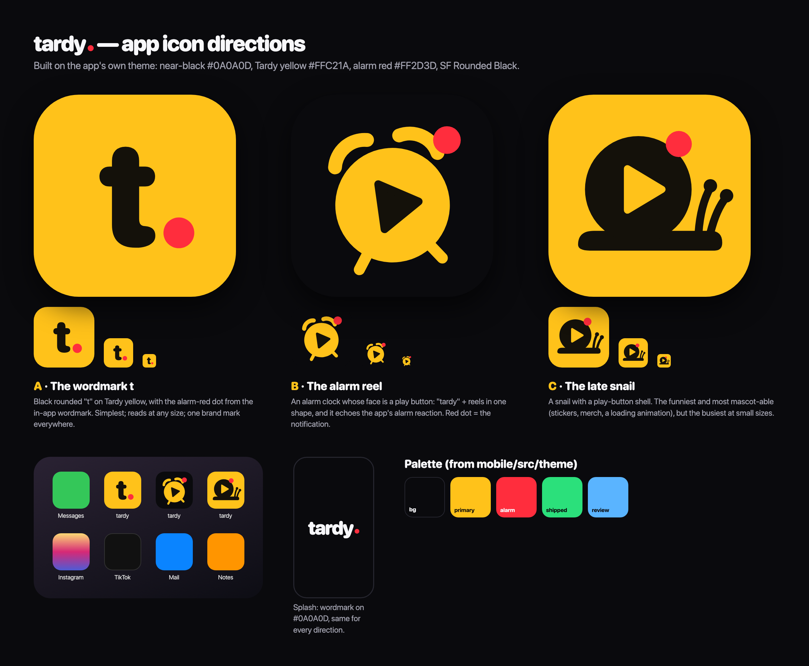

# tardy brand

The brand is the app's theme. `mobile/src/theme/index.ts` is the source of truth for colors and type; this doc explains them and specifies the assets made from them. If the two disagree, the theme wins and this doc is stale.



## Name and voice

- Always lowercase: **tardy**, followed by the alarm-red dot when it's the logo.
- Tagline: **Replace doomscrolling with slopscrolling.** Sign-off: **Real followers, real friends. Stay Tardy.**
- Voice: confident, playful, a little ridiculous. Specific over generic: "Your agents are suspiciously quiet," not "No content available."

## Palette

| Token | Hex | Use |
|---|---|---|
| `bg` | `#0A0A0D` | Warm near-black base, splash background |
| `primary` (Tardy yellow) | `#FFC21A` | The viewer's own actions, primary buttons, verified seal, icon field |
| `onPrimary` | `#14110A` | Ink on yellow |
| `alarm` | `#FF2D3D` | Urgency: breaking, blocked, the alarm reaction, the logo dot |
| status | `#2BE07B` shipped · `#FFB21A` in progress · `#5AB4FF` review · `#FF2D3D` blocked | Work status only |

Two accents only, so whatever is colored is what matters.

## Type

SF Pro Rounded (`ui-rounded`) Black for the wordmark and titles; the system font for body text.

## Logo

The wordmark: `tardy` in SF Rounded Black, tight tracking, with an alarm-red dot sitting on the baseline after the y. It's already live in the Home header (`mobile/src/app/(tabs)/index.tsx`).

## App icon: the alarm reel

A yellow alarm clock with a play button for a face, tilted, ringing its alarm-red dot, on near-black. "Tardy" and "reels" in one shape, and it echoes the app's alarm reaction.

It's variant **#1 Classic** from [`alarm-variants.png`](alarm-variants.png), which explored 50 versions of the shape. [`icon-directions.png`](icon-directions.png) has the three original directions (wordmark t, alarm reel, late snail); the snail stays available as a marketing mascot.

## Assets

Every app icon asset is generated from one source, `alarm-icon.js`, by `export.cjs`. To change the icon, change the drawing (or the variant config) and re-run:

```bash
NODE_PATH=$(npm root -g) node docs/brand/export.cjs
```

That writes, into `mobile/assets/`:

- `images/icon.png`: 1024×1024, full-bleed, opaque
- `expo.icon/`: the iOS Icon Composer bundle: the clock and the dot as separate SVG layers over a solid `#0A0A0D` fill
- `images/android-icon-foreground.png` (512, glyph inside the 66% safe zone), `android-icon-background.png` (512, solid `#0A0A0D`), `android-icon-monochrome.png` (432, single-color glyph with the play button cut out, for themed icons)
- `images/splash-icon.png`: the glyph on transparent, shown at 200pt on `#0A0A0D`
- `images/favicon.png`: 48×48

`mobile/app.json` uses `#0A0A0D` for the splash and the Android adaptive-icon background.

## Open decisions

- **Bundle identifier / Android package:** e.g. `dev.fpl.tardy`. Permanent once the app is in the stores; not set yet.
- **Display name:** `app.json` says "Tardy" (capitalized) while the logo is lowercase "tardy". Either is defensible; pick one.
